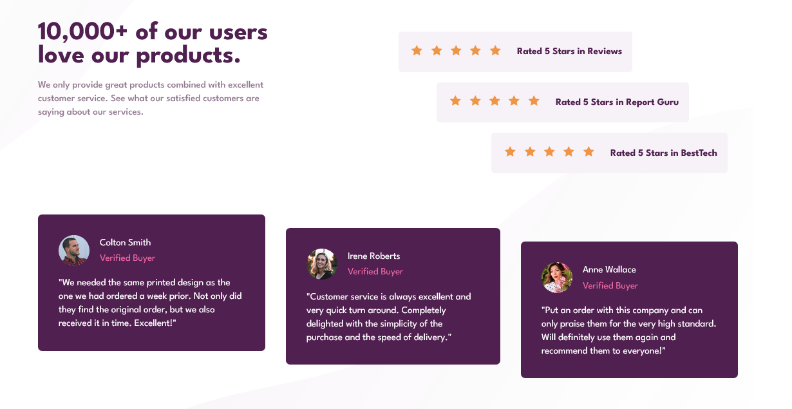

# Frontend Mentor - Social proof section solution

This is a solution to the [Social proof section challenge on Frontend Mentor](https://www.frontendmentor.io/challenges/social-proof-section-6e0qTv_bA). Frontend Mentor challenges help you improve your coding skills by building realistic projects.

## Table of contents

-   [Overview](#overview)
    -   [Screenshot](#screenshot)
    -   [Links](#links)
-   [My process](#my-process)
    -   [Built with](#built-with)
    -   [What I learned](#what-i-learned)
    -   [Continued development](#continued-development)
    -   [Useful resources](#useful-resources)

## Overview

### Screenshot



### Links

-   Solution URL: [TsbSankara Youtube](https://www.youtube.com/watch?v=9ROfWv981gg)
-   Live Site URL: [Github Pages](https://tlbtrung-222.github.io/social-proof-section/)

## My process

### Built with

-   CSS custom properties
-   Flexbox

### What I learned

-   Collapsing Margins Between Parent and Child Elements [Reading](https://www.sitepoint.com/collapsing-margins/)

-   Setting height for grid container and grid items

```css
.grid-container {
    display: grid;
    height: 30rem;
}
```

-   Stop using margin and padding to adjust element's position => make layout more responsive (instead using flexbox)

-   row-gap and column-gap can be used for both Flex and Grid layout

```css
.flex-container {
    display: flex;
    gap: 2rem 3rem;
}
```

-   In responsive section, select exactly the CSS selector to avoid specification bug

-   We can adjust an element by 3 ways :

#### flexbox

#### transform : translateX,Y()

#### margin

### Continued development

-   Semantic HTML5 markup

### Useful resources

